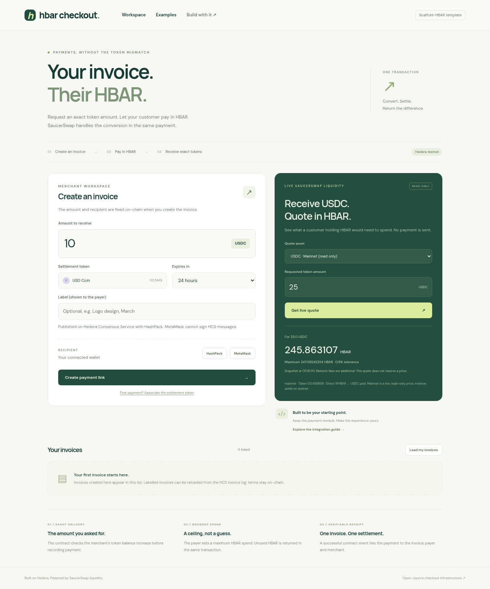
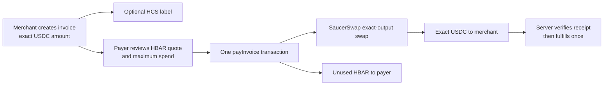

# HBAR Checkout

**Price in USDC. Let customers pay with the HBAR already in their HashPack wallet.**

HBAR Checkout is a [Scaffold-HBAR](https://docs.hedera.com/solutions/tools/scaffold-hbar/index) template for checkout on Hedera. A merchant creates an on-chain invoice for an exact amount of an HTS token (testnet USDC by default). The payer signs **one** transaction: the HBAR Checkout contract swaps their HBAR through SaucerSwap, checks that the merchant received exactly the invoiced tokens and refunds unused HBAR, or the whole transaction reverts. Your server then verifies the receipt before fulfilling the order. You reuse a React component, a server helper and the contract; the invoice workspace only demonstrates them.

**[Live demo](https://hbar-checkout.vercel.app)** · **[Paid invoice](https://hbar-checkout.vercel.app/pay/0x08c3361023db4b0b2097fe1b82f90ed5477056e570daca65967f81c521357791?tx=0xbc333a625dcc2f71703366f7f45a3277783fb21496f117e7882ab0761efc3dd8)** · **[Start locally](docs/GETTING_STARTED.md)** · **[Architecture](docs/ARCHITECTURE.md)** · **[Evidence](docs/VALIDATION.md)**



## Who it is for

Hedera dApps and merchants that **price in USDC (or another HTS token) while their users hold HBAR**:

- **Service invoices and payment links:** a freelancer or agency bills 100 USDC; the client pays from HashPack in HBAR.
- **Marketplace checkout:** the listing price stays fixed in USDC; the buyer does not swap manually first.
- **Prepaid API or compute credits:** a developer tops up 20 USDC of credits with HBAR; your backend credits the account once.

If payer and merchant already hold the same asset, a direct transfer is simpler. [Use cases, related projects and tradeoffs](docs/USE_CASES.md).

## Integrate in ten lines

In a page of the generated Next.js app, drop in the payment component:

```tsx
import { PayWithHbar } from "@/components/PayWithHbar";

<PayWithHbar
  invoiceId={order.invoiceId}
  onPaid={({ reference }) =>
    fetch(`/api/orders/${order.id}/fulfill`, {
      method: "POST",
      body: JSON.stringify({ invoiceId: order.invoiceId, reference }),
    })
  }
/>;
```

Fulfill only after your server has verified the payment on-chain:

```ts
import { verifyInvoicePayment } from "@hbar-checkout/checkout";
import { getConfig } from "@/lib/server";

const result = await verifyInvoicePayment(getConfig(), {
  invoiceId: order.invoiceId, // from your database, never from the browser
  reference, // EVM tx hash or Hedera transaction ID sent by onPaid
});
if (result.status === "paid") await fulfillOnce(order.id, result.payment);
```

`onPaid` is a UX signal, not proof. It fires again when a paid page is reloaded, so `fulfillOnce` must be idempotent. A working example endpoint is [`app/api/orders/[orderId]/fulfill`](packages/nextjs/app/api/orders/[orderId]/fulfill/route.ts). [Full recipe](docs/CUSTOMIZATION.md).

## What is real, what is a placeholder

| Real, verified on Hedera testnet ([evidence](docs/VALIDATION.md))                                                                                    | Placeholder or not yet tested                                                                                    |
| ---------------------------------------------------------------------------------------------------------------------------------------------------- | ---------------------------------------------------------------------------------------------------------------- |
| HBAR Checkout contract `0x140e…055E` settling testnet USDC `0.0.5449` through the SaucerSwap V1 router                                                   | `exampleOrders` / `exampleFulfillments` in the fulfill endpoint are in-memory maps standing in for your database |
| Two-wallet payment: exactly 1 USDC delivered, unused HBAR refunded, receipt re-verified by `npm run submission:check`                                | The fulfill endpoint verifies payment but delivers nothing; delivery and credit ledgers are yours                 |
| Native Hedera path (`ContractExecuteTransaction`, `TokenAssociateTransaction`) run by script with the same code HashPack uses                         | A real HashPack session and signature: not tested; it needs `NEXT_PUBLIC_WALLETCONNECT_PROJECT_ID`               |
| HCS invoice log `0.0.10814952`: a payer's fake label ignored, the merchant's label accepted                                                          | MetaMask signing through the UI: not exercised live                                                              |
| Read-only mainnet USDC quote from real SaucerSwap liquidity                                                                                          | Mainnet payments: disabled. The contract is unaudited                                                            |

## Hedera services used

| Service                             | Role in HBAR Checkout                                                                                                    |
| ----------------------------------- | ---------------------------------------------------------------------------------------------------------------------- |
| Smart contracts (HSCS)              | [`HbarCheckout.sol`](packages/hardhat/contracts/HbarCheckout.sol) stores invoice terms and settles atomically                |
| Token Service (HTS)                 | Settlement asset; merchant token association, freeze/KYC and custom-fee checks before payment                          |
| Consensus Service (HCS)             | Optional public invoice log: merchant-signed labels and a rebuildable invoice history                                 |
| Mirror node                         | Token metadata, association state, receipts by Hedera transaction ID, HCS messages                                     |
| SaucerSwap V1 (ecosystem protocol)  | Exact-output HBAR→token swap from existing liquidity; without it HBAR cannot settle a USDC invoice                     |
| HashPack via WalletConnect          | Native Hedera transactions, works with ED25519 and ECDSA accounts; MetaMask (ECDSA only) is the EVM alternative       |

## Run your own copy

Prerequisites: **Node.js 20.18.3 or newer**, npm, Git with your author identity configured, and internet access. No Hedera account is needed to see live quotes.

```bash
npx create-scaffold-hbar@latest --template STOOOKEEE/hbar-checkout
cd your-project
npm run dev
```

Choose Next.js, Hardhat and npm. Open http://localhost:3000, choose **USDC · Testnet** in the quote panel, enter `1` and click **Get live quote**. A failed network call shows an error, never a sample price. **Create payment link** stays disabled until you [deploy your checkout](docs/DEPLOYMENT.md); that is expected.

Direct clone instead: `git clone https://github.com/STOOOKEEE/hbar-checkout.git && cd hbar-checkout && npm ci && npm run dev`.

## How a payment works



A quote is a read, not a payment. If any settlement check fails, the payment reverts; network fees can still be charged. [Sequence, trust boundaries and units](docs/ARCHITECTURE.md).

## Find the right guide

| I want to…                                                       | Read                                       |
| ---------------------------------------------------------------- | ------------------------------------------ |
| Go from a fresh scaffold to a live quote                         | [Getting started](docs/GETTING_STARTED.md) |
| Deploy, create the HCS topic, create and pay an invoice          | [Testnet deployment](docs/DEPLOYMENT.md)   |
| Understand settlement, trust, HCS labels and Hedera units        | [Architecture](docs/ARCHITECTURE.md)       |
| Embed `PayWithHbar`, fulfill orders, change the token            | [Customization](docs/CUSTOMIZATION.md)     |
| Look up env vars, API routes, exports and events                 | [Reference](docs/REFERENCE.md)             |
| Fix a setup, quote, wallet, gas or receipt error                 | [Troubleshooting](docs/TROUBLESHOOTING.md) |
| Host my copy on Vercel                                           | [Web hosting](docs/HOSTING.md)             |
| See what was actually tested, with transaction IDs               | [Validation record](docs/VALIDATION.md)    |
| Review the template for the bounty / prepare the submission      | [Reviewer walkthrough](docs/REVIEW.md) · [Submission](docs/SUBMISSION.md) |
| Work with a coding agent                                         | [AGENTS.md](AGENTS.md)                     |

## Where to change the code

| Location                                                                                                    | Responsibility                                                                    |
| ----------------------------------------------------------------------------------------------------------- | --------------------------------------------------------------------------------- |
| [`packages/checkout/src/index.ts`](packages/checkout/src/index.ts)                                          | Quotes, amounts, deployment/association checks, transactions, receipt verification |
| [`packages/checkout/src/hcs.ts`](packages/checkout/src/hcs.ts)                                              | HCS invoice log: message format and the merchant-only label rule                  |
| [`packages/hardhat/contracts/HbarCheckout.sol`](packages/hardhat/contracts/HbarCheckout.sol)                      | Invoice terms, cancellation and atomic settlement                                 |
| [`packages/nextjs/components/PayWithHbar.tsx`](packages/nextjs/components/PayWithHbar.tsx)                  | Drop-in payer flow: quote, wallet, pay, `?tx=` recovery, verified receipt         |
| [`packages/nextjs/components/Workspace.tsx`](packages/nextjs/components/Workspace.tsx)                      | Example merchant workspace (create, label, list invoices)                         |
| [`packages/nextjs/lib/wallet.ts`](packages/nextjs/lib/wallet.ts)                                            | HashPack (native) and MetaMask (EVM) adapters                                     |
| [`packages/nextjs/app/api`](packages/nextjs/app/api)                                                        | Server-side reads and the example fulfill endpoint; no server signing key         |

## Check your changes

```bash
npm run lint && npm test && npm run build
PORT=3020 npm start                                   # terminal 1
SMOKE_ORIGIN=http://localhost:3020 npm run smoke      # terminal 2
```

`npm test` runs the TypeScript suite (quotes, units, receipts, HCS label rule, `verifyInvoicePayment`) and 11 contract tests; contract tests use mocks, not Hedera precompiles. Use `PORT=…` to change the port: `npm start -- -p 3020` does not work through the npm workspace wrapper. `npm run probe` reads live quotes on both networks.

## Scope and license

One fungible HTS token without custom fees per deployment, reached through a direct SaucerSwap V1 WHBAR pool. Mainnet is read-only. The contract is unaudited. This project does not use Hedera Harness. [MIT](LICENSE). Original plan and later decisions: [IMPLEMENTATION_PLAN.md](IMPLEMENTATION_PLAN.md).
