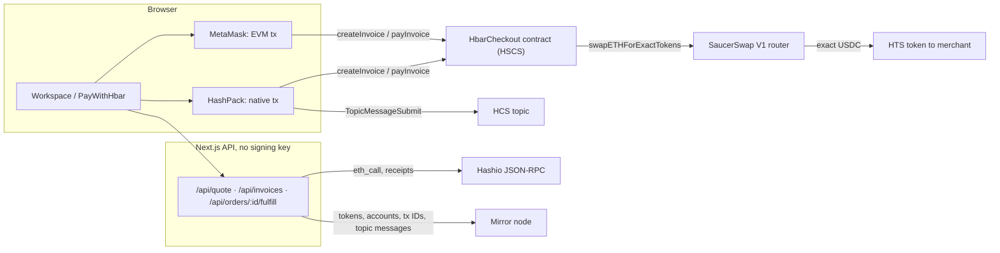
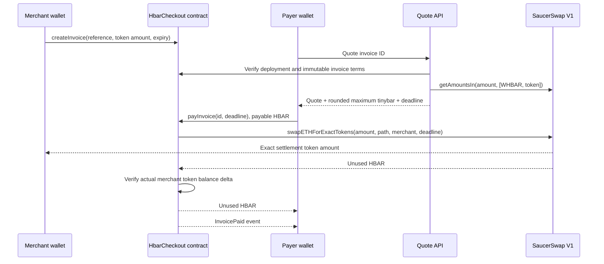

# Payment architecture

[README](../README.md) · [API reference](REFERENCE.md) · [Customization](CUSTOMIZATION.md)

**Pattern:** convert the payer's HBAR into the invoice's exact token amount and record settlement in the same transaction. The merchant creates the invoice beforehand. A quote is a read, not a reservation of liquidity. An optional HCS topic carries merchant-signed invoice descriptions; it never changes what the contract enforces.

## Components and trust

| Component               | Responsibility                                                                    | What it cannot prove                                                       |
| ----------------------- | --------------------------------------------------------------------------------- | -------------------------------------------------------------------------- |
| Browser + wallet        | Show terms and obtain user signatures (HashPack or EVM wallet)                    | A browser success message or `onPaid` callback is not payment evidence     |
| Next.js API             | Read configured contracts, mirror metadata, receipts and HCS labels               | A preflight cannot guarantee future liquidity or permission state          |
| Shared checkout package | Validate amounts/config, quote, build payment, verify receipt, parse HCS messages | Does not authenticate your application's customer or fulfill an order     |
| HbarCheckout contract   | Store immutable invoice terms and enforce settlement checks                       | Does not ship goods, grant credits or reverse completed payments           |
| HTS settlement token    | Hold the merchant's balance; association, freeze and KYC policy                   | A token symbol alone proves nothing; the token ID must match the contract  |
| SaucerSwap V1           | Execute exact-output conversion using existing liquidity                          | Does not know your application's order or fulfillment state               |
| HCS invoice log         | Ordered, timestamped merchant descriptions; rebuildable invoice history           | Not authoritative for amount, merchant or status; anyone can post to it    |
| Mirror node / RPC       | Expose metadata, contract state, transaction results and topic messages           | Reads lag (labels appeared ~7 s after consensus) or fail; a timeout is not a revert |

The server holds no signing key. Only wallets sign in the reference UI. The deployment and topic scripts separately use a local testnet key.

[`wallet.ts`](../packages/nextjs/lib/wallet.ts) exposes `connectWallet(config, kind)` with `kind` `"hashpack"` or `"evm"`, returning `{ kind, address, send(request), associate(), publish? }`:

- **HashPack:** `@hashgraph/hedera-wallet-connect` `DAppConnector` (`hedera_signAndExecuteTransaction`, chain `hedera:testnet`) and `@hiero-ledger/sdk`, lazy-loaded only when chosen. It uses the HashPack extension if detected, otherwise the WalletConnect QR modal. Writes are native `ContractExecuteTransaction`s; association is a native `TokenAssociateTransaction`; `publish(topicId, message)` is a native `TopicMessageSubmitTransaction`. ED25519 accounts work. `msg.sender` is the account's mirror-node `evm_address` (ECDSA alias, or long-zero address for ED25519). `send` returns a Hedera transaction ID.
- **EVM wallet (MetaMask):** EVM transactions through the JSON-RPC relay; association uses the HIP-719 `associate()` facade. ECDSA accounts only. `send` returns an EVM transaction hash. `publish` is undefined: an EVM wallet cannot sign HCS transactions.

`confirm(config, ref)` polls until the receipt is indexed. The invoice ID is read from the receipt's `InvoiceCreated` event.

### Gas limits

Both wallet paths send `bufferedGasLimit(eth_estimateGas)`, i.e. the estimate +25 % rounded up. The bare estimate is not enough: a `createInvoice` sent with exactly its 113,247-gas estimate failed with `INSUFFICIENT_GAS` ([`0xb030…3810`](https://hashscan.io/testnet/transaction/0xb0308981ab82975a1f1a37bd337e9a25a8dac19f4dffee2ffffdaa421b523810)), because reported `gasUsed` is net of storage refunds while execution needs the gross amount. In the 2026-10-01 measurements, Hedera charged `gasUsed × gas price` on both the EVM and native paths, not a share of the limit. The buffer therefore mainly sets the up-front balance a wallet reserves and the maximum fee it displays: under the earlier 2× rule, the MetaMask `associate()` limit of 2,047,050 gas represented about 1.76 HBAR at ~86 tinybar/gas, for an association that was charged 0.58 HBAR. [Measurements](VALIDATION.md#gas-limit-measurements--2026-10-01).

## Transaction sequence

## Source of truth

The contract stores invoices. References are random bytes32 in the demo; IDs are `keccak256(abi.encode(merchant, reference))`. Merchant namespaces prevent another account reserving someone else's reference. Creating the same invoice reference twice for one merchant is rejected, including after cancellation or payment.

The token, router and WHBAR token address are immutable for a deployment. An invoice fixes merchant, output amount and expiry. Only the merchant can cancel. Only open, unexpired invoices can be paid. The payment deadline must also be within the invoice lifetime.

Invoice status is set before external calls and protected by a reentrancy guard. Any swap, balance-check or refund failure reverts the transaction, including that state update. There is no background worker that must reconcile a partially completed swap and transfer.

## Amount units

| Boundary                                                           | Unit                                              |
| ------------------------------------------------------------------ | ------------------------------------------------- |
| Invoice output and ERC20-compatible HTS methods                    | Token smallest unit, determined by token decimals |
| SaucerSwap `getAmountsIn()[0]`                                     | Tinybar (8 decimal places per HBAR)               |
| Hedera EVM `msg.value`, `address.balance`, Solidity internal sends | Tinybar                                           |
| Ethereum JSON-RPC transaction `value` (EVM wallet)                 | Weibars / RPC wei (18 decimal places per HBAR)    |
| Native `ContractExecuteTransaction` payable amount (HashPack)      | Tinybar                                           |

On the EVM path, `tinybarToRpcWei` performs the **single** conversion at the wallet boundary: multiply by 10^10. The native path takes tinybar directly; `rpcWeiToTinybar` converts a built request back and rejects non-whole tinybar. `maximumSpend` rounds upward with integer arithmetic. ABI values remain in their actual native units. See the official [Hedera transaction unit documentation](https://docs.hedera.com/hedera/sdks-and-apis/sdks/smart-contracts/ethereum-transaction).

### Worked example (illustrative arithmetic, not a live quote)

For a 6-decimal token, `1.25` tokens means `1_250_000` output units. Suppose the router quotes `100_000_000` tinybar (1 HBAR). At 50 basis points (0.5%), the maximum is `100_500_000` tinybar. The wallet transaction's RPC `value` is `1_005_000_000_000_000_000` wei. Only native HBAR gets that conversion; the output stays `1_250_000` token units.

The router spends no more than the supplied cap. Any unused HBAR returns to the payer within settlement. Network fees are additional and are not part of this refund. A failed payment reverts its token/native transfers and invoice status, but can still incur network fees.

## Integration choices

SaucerSwap V1 RouterV3 provides an exact-output HBAR method with automatic surplus refund. The path is exactly `[WHBAR HTS token, settlement token]`. The WHBAR wrapper contract and the WHBAR HTS token are different addresses: path construction uses the token.

The application reads a current quote from the real router and checks the settlement token's metadata. For invoice payment it also checks the deployed immutable configuration, invoice state and merchant's token relationship through the mirror node. It does not assert that a successful quote guarantees successful execution: balances, association policy and liquidity can change.

The contract receives no settlement tokens: the router delivers directly to the merchant. This avoids requiring the checkout contract to associate every output asset. Before/after balance checks enforce exact receipt and reject under-delivery, including ordinary transfer-fee effects. The UI rejects tokens declaring custom fees before quoting.

A quote includes its chain ID, checkout, router, WHBAR and settlement token. The transaction builder rejects a quote from another context before requesting a signature. Read-only presets have no checkout or invoice and cannot be submitted as payments.

## Proof and recovery

After submission, `PayWithHbar` stores the transaction reference in the URL's `?tx=` before waiting for a receipt. Refreshing reads the on-chain invoice and verifies the receipt independently through the server. Verification checks successful status, destination, event emitter, invoice ID, merchant and output amount. It never interprets a bare transaction hash as success.

If a receipt is not available, keep the reference and refresh; do not blindly resubmit. If a transaction is confirmed reverted, its invoice remains open and the `tx` query parameter can be removed to request a new quote.

For fulfillment, `verifyInvoicePayment(config, { invoiceId, reference })` combines these reads on the server: it returns `pending` until the receipt is indexed **and** the invoice reads paid, `paid` with the verified payment, or throws `INVALID_RECEIPT`. Your order record supplies the invoice ID; fulfillment must be idempotent, keyed by chain ID, checkout address and invoice ID. See [Customization](CUSTOMIZATION.md#fulfill-the-order-on-your-server).

## HCS invoice log

The chain is authoritative for amount, merchant and status. The optional HCS topic only adds what the contract does not store: a human-readable description and a list of a merchant's invoices that survives a browser refresh.

- **Message (v1):** `{"v":1,"type":"invoice","checkout":"0x…","invoiceId":"0x…","label":"…"}`, UTF-8, one chunk, at most 1024 bytes. The label is one line of plain text, at most 140 characters, without control characters. Anything else is ignored.
- **Trust rule:** the topic is public (no submit key), so anyone can post. A label counts only if (1) the mirror node's `payer_account_id` for that message is the account of the invoice's **on-chain** merchant, and (2) it reached consensus **after** the invoice's creation, taken from the merchant's own successful `createInvoice` call to the checkout on the mirror node (nobody else can add to that list). The first such message in consensus order wins; later edits, pre-creation messages and everyone else's messages are ignored.
- **Who can post:** only HashPack, as a separate `TopicMessageSubmitTransaction` (small HCS fee, second approval) after invoice creation. The workspace checks the label and that the connected wallet can publish **before** sending `createInvoice`; if the HCS approval then fails, the invoice exists without a label. MetaMask cannot sign HCS messages, so it creates unlabelled invoices only.
- **Reads are bounded,** so topic spam cannot make them unbounded. `readInvoiceLabel` (used by `/api/invoices/:id`) looks for the creation in the merchant's newest 500 checkout calls and for the label in the first 300 topic messages after it. `listMerchantInvoices` (**Load my invoices**) reads the newest 1,000 merchant checkout calls and 1,000 topic messages, returns `{ invoices, truncated }` newest first, and re-reads each invoice from the contract. `truncated: true` means older calls or messages were not read. Only labelled invoices appear.

Live proof on topic `0.0.10814952`: the payer posted a fake label first (sequence 1) and it was ignored; the merchant's label (sequence 2) was returned. [Transactions](VALIDATION.md#hcs-invoice-log--2026-10-01).

## Deliberate limitations

No fee-on-transfer assets, route optimization, order database, account abstraction or mainnet signing. HCS history covers labelled invoices only. No HTS emulation is claimed for Hardhat unit tests. A production merchant should review token admin controls and deployment code; this starter is not audited.

Expiry is computed at read/payment time; no scheduler submits an expiry transaction. The merchant can cancel an invoice still stored as Open even after its expiry, but it can no longer be paid. The quote's 60-second lifetime is a client/package policy; the contract enforces the signed deadline against the invoice expiry.

## Terms used in the guides

| Term                   | Meaning here                                                                                                                           |
| ---------------------- | -------------------------------------------------------------------------------------------------------------------------------------- |
| HTS                    | Hedera Token Service; the settlement asset is a fungible HTS token                                                                     |
| Association            | An account's relationship to a token, required by this flow before the merchant can receive it; different from ERC20 spending approval |
| Exact output           | Merchant amount is fixed; HBAR required to obtain it varies                                                                            |
| Slippage allowance     | Extra permitted HBAR spend if price changes; not an automatic extra fee                                                                |
| Atomic settlement      | Conversion, exact receipt check, status update and surplus refund all succeed or revert together                                       |
| Receipt                | A successful transaction result containing the expected contract event                                                                 |
| Idempotent fulfillment | Reprocessing payment evidence does not ship twice or credit an account twice                                                           |

## Protocol references

- [SaucerSwap exact-output HBAR swaps](https://docs.saucerswap.finance/developers/v1/swap/swap-hbar-for-tokens)
- [SaucerSwap deployed contracts](https://docs.saucerswap.finance/developers/contracts)
- [Hedera Ethereum transaction units](https://docs.hedera.com/hedera/sdks-and-apis/sdks/smart-contracts/ethereum-transaction)
- [Hedera Consensus Service: submit a message](https://docs.hedera.com/hedera/sdks-and-apis/sdks/consensus-service/submit-a-message)
