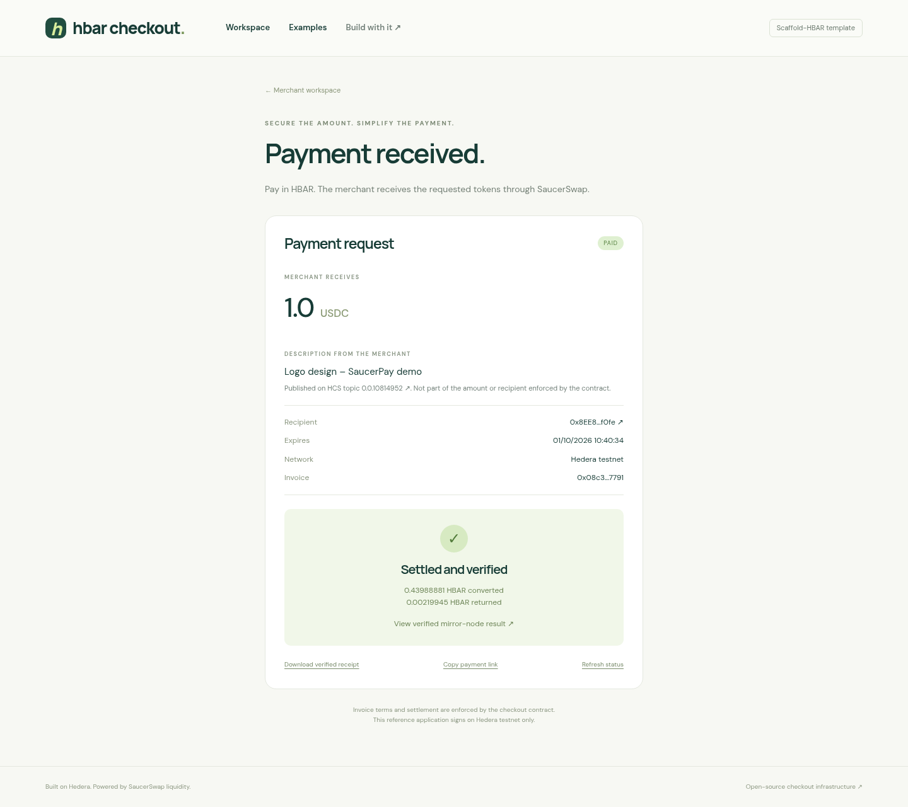

# Validation record

[README](../README.md) · [Reviewer walkthrough](REVIEW.md)

This file separates local checks, real protocol reads and actual transactions. Passing the first two does not imply a live payment succeeded. Newest records first; older records keep their original source revisions.

Records dated before 2026-10-02 were recorded under the former name SaucerPay. Their on-chain values (such as the HCS topic memo and label), package names, temporary paths and Vercel URLs are kept exactly as observed.

## Fresh public scaffold — 2026-10-01

Public source commit [`342fdc7`](https://github.com/STOOOKEEE/hbar-checkout/commit/342fdc71463946854bac43cb34c9eb5dba5192bc) (HCS log, `PayWithHbar`, fulfill endpoint, +25 % gas rule, Node 20.18.3 floor) was generated twice with `create-scaffold-hbar@0.4.1`, each time in a new empty `/tmp` directory with no env files, no keys and no local template override. Only a throwaway Git identity was supplied, through a temporary `GIT_CONFIG_GLOBAL` file:

```bash
npm create scaffold-hbar@latest -- --template STOOOKEEE/hbar-checkout --destination app \
  --frontend nextjs-app --solidity-framework hardhat --network testnet \
  --package-manager npm --skip-hedera-skills --ci
cd app && npm ci && npm run lint && npm test && npm run build
PORT=3040 npm start &
SMOKE_ORIGIN=http://localhost:3040 node scripts/smoke.mjs
curl http://localhost:3040/api/config
curl "http://localhost:3040/api/preview?preset=testnet-usdc&amount=1&slippageBps=50"
```

The generated tree contains `components/PayWithHbar.tsx` and `checkout/src/hcs.ts`. It matches `342fdc7` once the CLI's own changes are discounted: Prettier formatting, `npm X` → `npm run X` prose, `packageManager` fields, consumed `template.json`.

| Step                              | Node 22.23.2 / npm 10.9.8        | Node 20.18.3 / npm 10.9.8                                                                    |
| --------------------------------- | -------------------------------- | -------------------------------------------------------------------------------------------- |
| Generation (CLI installs and commits) | Pass                         | Pass                                                                                         |
| `npm ci`                          | Pass, 741 packages               | Pass, 740 packages; non-blocking `EBADENGINE` warnings (vite 7, chokidar/readdirp 5, `@wallet-standard/base`) |
| `npm run lint` (ESLint + both typechecks) | Pass                     | Pass                                                                                         |
| `npm test`                        | Pass: 38 TypeScript, 11 contract | Pass: 38 TypeScript, 11 contract                                                             |
| `npm run build`                   | Pass                             | Pass                                                                                         |
| `PORT=3040 npm start` + smoke     | Pass: `/`, `/guide`, `/examples`, `/pay/<id>`, invalid network, preview limits, fulfill rejections | Pass, same OK lines                         |
| `/api/config`                     | HTTP 200, testnet, token `0.0.5449`, `checkout: null` (no env) | Same                                           |
| `/api/preview?preset=testnet-usdc&amount=1&slippageBps=50` | HTTP 200, live quote: `amountOut` `1000000`, `quotedTinybar` `44054615`, `maximumTinybar` `44274889` | Same values |

A first run against `dee0b98` failed at `npm run build`: Turbopack could not resolve `@reown/appkit*`, `@reown/walletkit`, `@walletconnect/*` or `@hiero-ledger/proto` from `@hashgraph/hedera-wallet-connect`. Lint and tests had passed. Root cause: the CLI installs with `npm install --legacy-peer-deps`, which rewrites the lockfile without peer dependencies, and the wallet library declares those packages only as peers. `342fdc7` declares them, plus `protobufjs` (peer of `@hiero-ledger/proto`), as exact direct dependencies of `packages/nextjs`. The versions are the ones already locked, so resolution is unchanged. A local copy installed with `npm install --legacy-peer-deps` then also built.

## HCS invoice log — 2026-10-01

Topic [`0.0.10814952`](https://hashscan.io/testnet/topic/0.0.10814952) was created by `npm run hardhat:topic` in transaction `0.0.10669846@1790888761.650379281`: memo `saucerpay:0x140e27Cf63790a558d66C8796A67984d5164055E`, admin key = deployer `0.0.10669846`, no submit key (public).

The trust rule was tested on the paid USDC invoice `0x08c3…7791` (on-chain merchant `0x8EE8…f0fe` = account `0.0.10669846`). Both messages were submitted by throwaway scripts with the local testnet keys, **not** through the HashPack app. [Raw topic messages on the mirror node](https://testnet.mirrornode.hedera.com/api/v1/topics/0.0.10814952/messages):

| Seq | Payer account                | Transaction ID                        | Consensus timestamp    | Label                          | Result                  |
| --- | ---------------------------- | ------------------------------------- | ---------------------- | ------------------------------ | ----------------------- |
| 1   | `0.0.10669929` (invoice payer) | `0.0.10669929@1790888997.728943908` | `1790889004.545829448` | `FAKE: pay 0.0.666 instead`    | Ignored: not the merchant |
| 2   | `0.0.10669846` (merchant)    | `0.0.10669846@1790888997.970953852`   | `1790889006.021806835` | `Logo design – SaucerPay demo` | Accepted                |

`readInvoiceLabel` returned the sequence 2 label even though the fake came first in consensus order. `listMerchantInvoices` returned this invoice (paid, labelled) for the merchant and an empty list for the payer. On a local dev server with `HEDERA_TOPIC_ID=0.0.10814952`, `GET /api/invoices/0x08c3…7791` returned `label: { text: "Logo design – SaucerPay demo", consensusTimestamp: "1790889006.021806835", topicId: "0.0.10814952" }`. The label was readable about 7 s after the receipt. Unit tests in [`hcs.test.ts`](../packages/checkout/test/hcs.test.ts) (seven at the time) cover the merchant-only rule, first-wins ordering across pages, malformed/oversized/multi-chunk messages and history filtering. On 2026-10-01 the mirror endpoint above was re-read and still lists exactly these two messages.

These live reads ran against the first version of the reader. It was then hardened after code review: a label must also reach consensus after the merchant's `createInvoice` call, mirror scans are bounded, and `listMerchantInvoices` returns `{ invoices, truncated }` newest first. Both messages above came after the invoice's creation, so the expected result is unchanged, but the live reads have **not** been re-run on the hardened version; its unit tests are the current evidence.

**Not tested:** publishing a label from a real HashPack session (`Wallet.publish`).

## Gas limit measurements — 2026-10-01

The write gas rule changed from 2× to **+25 %, rounded up** (`bufferedGasLimit`; `testnet-payment.cjs` mirrors it). Each row is a real testnet transaction against checkout `0x140e…055E`; fees are the HBAR debited, from the mirror node.

| Method / path               | Estimate | Gas limit           | Gas used    | Fee (tinybar)        | Result                 | Transaction |
| --------------------------- | -------- | ------------------- | ----------- | -------------------- | ---------------------- | ----------- |
| `createInvoice` EVM         | 113,247  | 113,247 (bare)      | 113,247     | 9,383,108            | **`INSUFFICIENT_GAS`** | [`0xb030…3810`](https://hashscan.io/testnet/transaction/0xb0308981ab82975a1f1a37bd337e9a25a8dac19f4dffee2ffffdaa421b523810) |
| `createInvoice` EVM         | 113,262  | 226,524 (old 2×)    | 94,385      | 7,550,800 (80/gas)   | Success                | [`0xfd9a…621a`](https://hashscan.io/testnet/transaction/0xfd9a096c0590465556bee3b07dcf8421512c4f4801024e9384aee4f450f5621a) |
| `createInvoice` EVM         | 113,247  | 120,000 (probe)     | 94,373      | 7,738,586            | Success                | [`0x15f7…7131`](https://hashscan.io/testnet/transaction/0x15f74d10e634dda42a22b03d7e0adb624b74665ab25e7055b3575272d1107131) |
| `createInvoice` EVM         | 113,247  | 141,559 (+25 %)     | 94,373      | 7,738,586 (82/gas)   | Success                | [`0x56f7…9862`](https://hashscan.io/testnet/transaction/0x56f756bee17d08b7a427f18da16188df9792214045220d7d6ab9e95b25aa9862) |
| `createInvoice` native      | 113,247  | 141,559 (+25 %)     | 94,373      | 7,738,586            | Success                | `0.0.10669846-1790889012-437221230` |
| `payInvoice` EVM            | 234,710  | 469,420 (old 2×)    | 194,248     | 15,539,840 (80/gas)  | Success                | [`0xbc33…3dd8`](https://hashscan.io/testnet/transaction/0xbc333a625dcc2f71703366f7f45a3277783fb21496f117e7882ab0761efc3dd8) |
| `payInvoice` EVM            | 213,722  | 235,095 (×1.1 probe)| 194,248     | 15,928,336           | Success                | [`0x8e8d…8576`](https://hashscan.io/testnet/transaction/0x8e8d75bbb4a1855d5b971d19eb416ba6c2791fe256c411ef856749ba632b8576) |
| `payInvoice` EVM            | 213,722  | 267,153 (+25 %)     | 194,248     | 15,928,336 (82/gas)  | Success                | [`0xbbff…049e`](https://hashscan.io/testnet/transaction/0xbbffc3fdc44e27ff2b734056574db8a94d7b10bf11eed7749aa004f04812049e) |
| `payInvoice` native         | 213,722  | 267,153 (+25 %)     | 194,248     | 15,928,336           | Success                | `0.0.10669929-1790889081-524302413` |
| `cancelInvoice` EVM         | 50,504   | 101,008 (old 2×)    | 42,087      | 3,451,134            | Success                | [`0xa8ee…301d`](https://hashscan.io/testnet/transaction/0xa8ee177d6e5ed7bbf1ab4ee33707c3e0abea9893e19315ca4225e5c19cf5301d) |
| `cancelInvoice` EVM         | 50,492   | 63,115 (+25 %)      | 42,077      | 3,450,314            | Success                | [`0x5a4e…7bb5`](https://hashscan.io/testnet/transaction/0x5a4e404d9ad70b9f52c803bef6a9cc83e8b5e4429c1d3fe4fb435b237ee37bb5) |
| `associate()` facade EVM    | 1,023,525| 2,047,050 (old 2×)  | 726,488     | 58,119,040           | Success                | [`0x939f…b2`](https://hashscan.io/testnet/transaction/0x939f0984a84bfda013fbfbc52862d4558db8953fb7efbaf95f27b3b516c10eb2) |

Findings:

- **Fee = gas used × gas price**, on both `EthereumTransaction` and native `ContractExecute` (e.g. 94,385 × 80 = 7,550,800 exactly). Fee differences between rows come from the gas price moving from 80 to 82 tinybar/gas, not from the limit. Lowering the buffer does not lower the fee charged; it lowers the balance a wallet must hold and the maximum fee it displays (the old `associate()` limit represented ~1.76 HBAR at ~86 tinybar/gas, against 0.58 HBAR charged).
- **The bare estimate is unsafe:** reported gas used is net of storage refunds, but execution needs the gross amount. `createInvoice` failed at its estimate and passed at ×1.06; `payInvoice` passed at ×1.1. +25 % covers both with margin.
- **Not re-run with +25 %:** the `associate()` facade (its new limit would be 976,052 against 726,488 used under the old limit) and the Hardhat `testnet:payment` script end to end. HashPack uses native `TokenAssociate`, which has no gas limit (0.47 HBAR observed earlier).
- `npm test -w @saucerpay/checkout` passed 33/33 with the updated `bufferedGasLimit` cases.

## Drop-in payment component and fulfill endpoint — 2026-10-01

Local dev server with the USDC checkout and topic configured. No transaction was created.

- Chromium, `/pay/0x08c3…7791?tx=0xbc33…3dd8` rendered by `PayWithHbar`: "Payment received.", "Settled and verified", 0.43988881 HBAR converted, 0.00219945 HBAR returned, and the HCS description "Logo design – SaucerPay demo" with its topic link. **Download verified receipt** produced the expected JSON. A missing invoice showed "Invoice does not exist on this deployment." with Retry. `/examples` rendered both integration snippets. No page errors.
- `POST /api/orders/:orderId/fulfill` with curl: bad JSON 400 `INVALID_REQUEST`; bad invoice 400 `INVALID_INVOICE`; bad reference 400 `INVALID_RECEIPT`; unknown order 404; another invoice 409 `INVOICE_MISMATCH`; unindexed hash 202 pending; the deployment transaction as reference 400 `INVALID_RECEIPT`; the real payment `0xbc33…3dd8` 200 with `spentTinybar` 43988881; a repeat call returned the same 200 payload.
- Four `verifyInvoicePayment` unit tests (pending, paid, wrong invoice/amount, malformed reference rejected before any fetch) pass. `scripts/smoke.mjs` now also checks the fulfill endpoint's 400/404 paths; it passed against that server.



## Node 20.18.3 compatibility — 2026-10-01

In an isolated worktree of commit `df6d11d` with Node v20.18.3 and npm 10.9.8, and no env files:

| Step                                                         | Result                                                                                  |
| ------------------------------------------------------------ | --------------------------------------------------------------------------------------- |
| `npm ci`                                                     | Pass. Non-blocking `EBADENGINE` warnings: vite 7 (via vitest 3), chokidar/readdirp 5, `@wallet-standard/base`, unused React Native peers |
| `npm run lint`                                               | Pass                                                                                    |
| `npm test`                                                   | Pass: 22 TypeScript, 11 contract tests                                                  |
| `npm run build`                                              | Pass: Hardhat compile, Next.js 16.3.5 build, all routes                                 |
| `PORT=3020 npm start` + `SMOKE_ORIGIN=http://localhost:3020 node scripts/smoke.mjs` | Pass, all OK lines                                               |
| `/api/config`, `/api/preview?preset=testnet-usdc`, `/api/quote?network=testnet&amount=1` | HTTP 200 with live testnet quotes                            |

`engines.node` was then lowered from `>=22.0.0` to `>=20.18.3` in `package.json`, `template.json` and the lockfile. `npm start -- -p 3020` fails on any Node version (`next start 3020` → "Invalid project directory"); use `PORT`. Keep vitest 3: vitest 4 requires Node ^22.12. The Vercel packaging script still selects the Node 22.x runtime for hosting. The later HCS and fulfill changes were re-run on Node 20 in the [fresh public scaffold](#fresh-public-scaffold--2026-10-01).

## Hosted app on the USDC checkout — 2026-10-01

`https://saucerpay-hedera.vercel.app/api/config` returns testnet token `0.0.5449`, checkout `0x140e27Cf63790a558d66C8796A67984d5164055E` and topic `0.0.10814952`. The public `/api/invoices/0x08c3…7791?tx=0xbc33…3dd8` returns status `paid`, `amountOut` `1000000`, `spentTinybar` `43988881` and the HCS label `Logo design – SaucerPay demo`, and the hosted smoke (`SMOKE_ORIGIN=https://saucerpay-hedera.vercel.app node scripts/smoke.mjs`) passes. On 2026-10-02 `NEXT_PUBLIC_WALLETCONNECT_PROJECT_ID` was set on Vercel; in headless Chromium, clicking **HashPack** on the hosted workspace opens the WalletConnect modal listing HashPack. No real HashPack session or signature has been tested yet.

## Live testnet USDC deployment and payment — 2026-10-01

The reference checkout is deployed on Hedera testnet (chain 296) at
`0x140e27Cf63790a558d66C8796A67984d5164055E` by deployer
`0x8EE8292BDD3E80Af225c2a91Afcc45ccA800f0fe`. The settlement asset is the
testnet token `0.0.5449` ("USD Coin", USDC, six decimals, treasury `0.0.3923`,
no custom fees, no KYC key, not frozen by default), reached through the real
SaucerSwap V1 testnet router (`0.0.19264`) and its WHBAR pool. It is **not**
Circle's testnet USDC issuance `0.0.429274`, which has no direct SaucerSwap V1
pool (its quote call fails). Testnet pool prices are not market prices.
No mainnet payment is claimed; mainnet USDC (`0.0.456858`) is a read-only quote.

| Evidence                  | Public result |
| ------------------------- | ------------- |
| Contract deployment       | [Successful Hedera Mirror Node result](https://testnet.mirrornode.hedera.com/api/v1/contracts/results/0xf7cd48ffb48e9385be5f1be7aa064921754398ab7f1a6f670c251da907d29ed1) · [HashScan](https://hashscan.io/testnet/transaction/0xf7cd48ffb48e9385be5f1be7aa064921754398ab7f1a6f670c251da907d29ed1) |
| Merchant-created invoice  | Transaction `0xfd9a096c0590465556bee3b07dcf8421512c4f4801024e9384aee4f450f5621a` |
| Separate-payer settlement | [Successful Hedera Mirror Node result](https://testnet.mirrornode.hedera.com/api/v1/contracts/results/0xbc333a625dcc2f71703366f7f45a3277783fb21496f117e7882ab0761efc3dd8) · [HashScan](https://hashscan.io/testnet/transaction/0xbc333a625dcc2f71703366f7f45a3277783fb21496f117e7882ab0761efc3dd8) |

The merchant was `0x8EE8292BDD3E80Af225c2a91Afcc45ccA800f0fe`; the separately
funded payer was `0x43937DB58f8530B47E807CA9A166F2a9fF7F3645`. Invoice
`0x08c3361023db4b0b2097fe1b82f90ed5477056e570daca65967f81c521357791`
is paid with `amountOut` `1000000`: exactly **1 USDC**. The transaction spent
`43,988,881` tinybar (`0.43988881` HBAR) on conversion and returned `219,945`
tinybar (`0.00219945` HBAR) of unused input to the payer. Network fees are
additional. `npm run submission:check` passed against this payment.

The payment was executed with `npm run testnet:payment`, not through a browser
wallet. When this record was written, the hosted app still served the earlier
SAUCE deployment; it was switched to this checkout later the same day (see
[Hosted app on the USDC checkout](#hosted-app-on-the-usdc-checkout--2026-10-01)).
Browser/wallet UI payment in USDC and mainnet signing have **not** been
exercised live.

## Native Hedera transaction path (HashPack code) — 2026-10-01

The native path in [`wallet.ts`](../packages/nextjs/lib/wallet.ts) was exercised
against the USDC checkout above by a throwaway Node script. It called the same
`contractExecute`/`tokenAssociate`/`confirm` functions with the local testnet
keys, **not** through the HashPack app:

- Native `TokenAssociateTransaction` by payer `0.0.10669929`: `SUCCESS`.
- Native `ContractExecuteTransaction` `createInvoice` by merchant `0.0.10669846`:
  transaction `0.0.10669846@1790843861.526670156` (EVM hash
  `0x8bc412b067848682ea87db71d8bbe7615f82faf971e3be6a11af3c8b1da389c6`), invoice
  `0x87a0b28b9f5491e1771b120d316b4709664395eebeb95d14ce6f49a3ddf098c9`.
- Native `ContractExecuteTransaction` `payInvoice` by the payer: transaction
  `0.0.10669929@1790843870.331092130` (EVM hash
  `0xec5054f6e253d40b846a43aa3f9651e29fdd34a539b03841cc778487a40bbc0c`,
  [Hedera Mirror Node result](https://testnet.mirrornode.hedera.com/api/v1/contracts/results/0xec5054f6e253d40b846a43aa3f9651e29fdd34a539b03841cc778487a40bbc0c)).
  It delivered exactly 1 USDC, spent `43,989,167` tinybar and refunded `219,946`
  tinybar. `verifyPaymentReceipt` passed, and the receipt `to` was the checkout
  EVM address.

On a local production server,
`/api/invoices/0x87a0…98c9?tx=0.0.10669929@1790843870.331092130` returned the
invoice as paid and verified. In a browser, the transaction-ID URL rendered
“Settled and verified”. `npm run smoke`, lint, 22 checkout tests, 11 contract
tests and the build passed. With a dummy WalletConnect project ID, the
connector loaded and opened the WalletConnect modal. **No real HashPack wallet
session or signature has been tested**: that needs a real project ID and a
HashPack account.

## Earlier SAUCE testnet deployment and payment — 2026-09-22

This earlier record remains valid historical evidence. The checkout was deployed
on Hedera testnet (chain 296) at
`0x92eD50589e2c594c8417234818B6FD7fDEA69334`. Its settlement
asset is SAUCE (`0.0.1183558`, six decimals), reached through the real
SaucerSwap V1 testnet router (`0.0.19264`). No mainnet payment is claimed.

| Evidence                  | Public result                                                                                                                                                                                                                                                                                      |
| ------------------------- | -------------------------------------------------------------------------------------------------------------------------------------------------------------------------------------------------------------------------------------------------------------------------------------------------- |
| Contract deployment       | [Successful Hedera Mirror Node result](https://testnet.mirrornode.hedera.com/api/v1/contracts/results/0xf810bf564aab4a305b30af5ddff6f95ed87aa8776a439a256f7c846cbb50c136)                                                                                                                                                      |
| Merchant-created invoice  | [Successful Hedera Mirror Node result](https://testnet.mirrornode.hedera.com/api/v1/contracts/results/0xdcab8b3a722e14191dcbdaca9b0db7ab4d22ec1c5687ee60b2690c143e027a8b)                                                                                                                                                      |
| Separate-payer settlement | [Successful Hedera Mirror Node result](https://testnet.mirrornode.hedera.com/api/v1/contracts/results/0xd9d3d092b020d8d0e05825f7636f1be6085d3e935a18d2286d4a5448f42a85d1) · [HashScan](https://hashscan.io/testnet/transaction/0xd9d3d092b020d8d0e05825f7636f1be6085d3e935a18d2286d4a5448f42a85d1) |
| Hosted receipt            | [Paid invoice with matching transaction](https://saucerpay-hedera.vercel.app/pay/0x8f97d7a7c61394e9f927e2b0d9d7b62fc396d091cfffc0475ab3b13493b58e61?tx=0xd9d3d092b020d8d0e05825f7636f1be6085d3e935a18d2286d4a5448f42a85d1)                                                                         |

The merchant was `0x8EE8292BDD3E80Af225c2a91Afcc45ccA800f0fe`; the separately
funded payer was `0x43937DB58f8530B47E807CA9A166F2a9fF7F3645`. Invoice
`0x8f97d7a7c61394e9f927e2b0d9d7b62fc396d091cfffc0475ab3b13493b58e61`
is paid. The merchant's token balance increased by exactly **1 SAUCE**
(`1,000,000` base units). The transaction spent `1,819,519` tinybar
(`0.01819519` HBAR) on conversion and returned `9,098` tinybar
(`0.00009098` HBAR) of unused input to the payer. Network fees are additional.

`npm run submission:check` passed against the two-wallet payment, verifying
the deployed contract, invoice terms, payment event and successful mirror-node
result. Source lint and type checks, 20 TypeScript tests, 11 contract tests,
and the production Solidity/Next.js build passed. `npm audit --omit=dev`
reported no production vulnerabilities. The public Vercel API returned the
same paid invoice, merchant, payer and amount. In Chromium, the paid page
rendered without errors, and the verified receipt download contained the
matching merchant, payer, amount and hash. The browser-exported file passed
`npm run submission:check -- /tmp/saucerpay-verified-receipt.json`. The 390px
mobile page had no horizontal overflow.
Production deployment `dpl_J1KuY89MWRU6yAczLDd9W8kG7CHv` is
live at [saucerpay-hedera.vercel.app](https://saucerpay-hedera.vercel.app);
its page and API smoke checks passed. The private testnet keys remain only in
ignored local env files, with no key on Vercel.

The first invoice submission failed with `INSUFFICIENT_GAS`: the mirror relay
estimated `113,262` gas and the transaction exhausted exactly that limit.
The script and wallet UI then sent writes with a 2× gas-limit margin (since
reduced to +25 %, see [gas measurements](#gas-limit-measurements--2026-10-01)). Invoice
creation and payments with one and then two accounts succeeded after that
change. An EVM transfer to the initially absent payer account also exhausted
its gas. A native Hedera SDK transfer created and funded that account successfully.
These failed attempts incurred testnet fees but are not cited as payment proof.

The signed payment was executed through the two-account script, and the hosted
read/receipt/download flow was tested. Injected-wallet signing and mainnet
signing were not exercised live in this earlier run. The
contest entry and developer-experience survey have not been submitted.

## Fresh public scaffold — 2026-09-22

Public source commit [`57483b85056ad6181c4095a34f711ab5fe0bca96`](https://github.com/STOOOKEEE/hbar-checkout/commit/57483b85056ad6181c4095a34f711ab5fe0bca96)
was generated into an empty `/tmp/saucerpay-fresh-live-57483b8` directory
using `create-scaffold-hbar@0.4.0`, `--template STOOOKEEE/hbar-checkout`,
Next.js, Hardhat, npm, testnet and `--skip-hedera-skills`. The CLI installed
dependencies and initialized Git. No local template override or wallet key
was supplied; `template.json` was consumed as expected and the root
`AGENTS.md` remained available.

The generated project passed lint, both TypeScript checks, **20 shared tests**,
**11 contract tests**, Solidity compilation and the production Next.js build.
It booted on port 3032 and passed the route smoke. The documented CLI example
returned a real read-only quote for 1 testnet SAUCE. [GitHub Actions passed on
that source commit](https://github.com/STOOOKEEE/hbar-checkout/actions/runs/35776567692).

## Bounty optimization before the live deployment — 2026-09-22

- Public source `56e15734da4247f717f16869bc2f787c09410289` was freshly generated with the published Scaffold-HBAR CLI, installed, linted, tested, built and booted on port 3024. Its route smoke passed. [Source CI also passed](https://github.com/STOOOKEEE/hbar-checkout/actions/runs/35717199298).
- The optimized frontend was deployed through the authenticated owner account as Vercel production deployment `dpl_3XCr7P9SUjrsYW1meFPWFG1EdXsr`. The permanent project domain is [saucerpay-hedera.vercel.app](https://saucerpay-hedera.vercel.app); the original project domain remains available.
- The new domain was explicitly added to the project's production domains. Public HTTP checks confirm direct responses without Vercel authentication redirects. Browser checks on this public origin passed, including real quotes and mobile examples.
- Lint/types, 19 shared-package tests and 11 contract tests pass (30 total).
- Production build and smoke cover the workspace, examples, guide and invoice route.
- The new preview endpoint returns real mainnet USDC and testnet SAUCE quotes.
- Browser checks cover both product examples, stale quote invalidation, delayed-response rejection, disabled undeployed writes and desktop/mobile layouts without page errors.
- Quote construction rejects mismatched chain, checkout, router, token and WHBAR context; legacy/unbound quotes and previews cannot become payments.
- At that revision, the submission script only exercised its missing-evidence branch. The successful live-testnet branch is recorded above.
- At that revision, the receipt download existed but had no live evidence. The current hosted receipt and browser download are verified above.


## Documentation walkthrough — 2026-09-22

The revised developer guides were exercised against public source commit
`19ea7307316c779e044fed6ddaed0ef08b1c4c2f` in a new directory generated by
`npx create-scaffold-hbar@latest`, using `--template STOOOKEEE/hbar-checkout`.
The non-interactive check supplied a destination, supported defaults and a
temporary Git author identity, and skipped optional Hedera skill installation.
No local template override or pre-existing node_modules was used.

| Check                                                 | Observed result                                                              |
| ----------------------------------------------------- | ---------------------------------------------------------------------------- |
| Generator installation                                | Pass; new guides/example copied and manifest consumed                        |
| README generator entry point after generation         | Preserved and valid                                                          |
| Fresh app lint/types, 19 tests and production build   | Pass                                                                         |
| Fresh production boot on port 3022 and route smoke    | Pass                                                                         |
| Documented CLI quote example                          | Real testnet quote for 1 SAUCE, no transaction                               |
| Documented quote API call                             | HTTP 200; `amountOut` was `1000000`                                          |
| Documented invalid-network call                       | HTTP 400 with `INVALID_NETWORK`                                              |
| Both complete TypeScript snippets in CUSTOMIZATION.md | Extracted and typechecked successfully; signing snippet was not executed     |
| Relative Markdown links and anchors                   | Checked against files/headings                                               |
| Source CI for this revision                           | [Pass](https://github.com/STOOOKEEE/hbar-checkout/actions/runs/35715530610) |

The following historical records retain their original source revisions. This
documentation walkthrough did not deploy a contract or submit a payment.

## Local checks (historical, 2026-09-22)

Validated on Node.js 22.23.2 and npm 10.9.8 at that revision:

| Check                                                       | Result                                                                                                                                 |
| ----------------------------------------------------------- | -------------------------------------------------------------------------------------------------------------------------------------- |
| ESLint + both TypeScript packages                           | Pass                                                                                                                                   |
| Shared checkout tests                                       | 8 passing                                                                                                                              |
| Solidity payment invariant tests                            | 11 passing                                                                                                                             |
| Production Solidity + Next.js build                         | Pass                                                                                                                                   |
| Production route smoke                                      | Pass: `/`, `/guide`, `/pay/<id>`, invalid-network API error                                                                            |
| GitHub Actions source CI                                    | [Pass](https://github.com/STOOOKEEE/hbar-checkout/actions/runs/35672872909)                                                           |
| Actual public external-template generation                  | Pass with `create-scaffold-hbar@0.4.0`                                                                                                 |
| Fresh generated app install/lint/19 tests/build/start/smoke | Pass                                                                                                                                   |
| Browser checks (Chromium)                                   | Pass: live testnet and mainnet quotes, disabled creation before deployment, guide navigation, undeployed-invoice error, no page errors |
| Responsive check                                            | 1440px desktop and 390px mobile; no horizontal mobile overflow                                                                         |
| Missing deployment key                                      | Clear failure before any transaction is submitted                                                                                      |

The external-template validation downloaded `STOOOKEEE/hbar-checkout` from GitHub at implementation commit `51f9e4b`, installed dependencies through the published CLI and ran checks in `/tmp/saucerpay-fresh`. No local-template override was used. The CLI consumes `template.json`; that is expected behavior. Git author identity was supplied only for the isolated validation process.

The upstream CLI rewrites some npm prose during generation. The README and app guide use the equivalent `npx create-scaffold-hbar@latest --template STOOOKEEE/hbar-checkout` entry point so their install commands remain valid in generated projects. The standard npm-create entry point was the one exercised during validation.

Contract tests cover exact delivery, surplus refund, duplicate settlement, duplicate merchant references, merchant namespaces, cancellation authorization, expiry, maximum spend, under-delivery, withheld refunds, refund rejection and reentrancy. These use mock tokens/router and do not emulate HTS precompiles.

TypeScript tests cover integer rounding, decimal precision, tinybar/RPC-wei conversion, stale/mismatched quotes, mainnet write rejection, entity IDs, event emitter/terms verification, live-call construction and explicit network/unsupported-token failure.

## Live read-only probe

Observed 2026-09-22, using real `getAmountsIn` calls with one SAUCE as the requested output:

| Network | Router ID   | Token ID    | Observed required HBAR |
| ------- | ----------- | ----------- | ---------------------- |
| Testnet | 0.0.19264   | 0.0.1183558 | 0.01819518             |
| Mainnet | 0.0.3045981 | 0.0.731861  | 0.16795432             |

These are historical diagnostic observations, not prices promised by the app. Run `npm run probe` for a new observation. No transaction was submitted by these reads.

## Initial quote-only Vercel demo (historical)

Published on 2026-09-22 at
https://temporary-express-mesa-bvkp923.vercel.app using Vercel CLI 59.25.0.
Vercel reported deployment `dpl_7iBBcrpFhNJQLM7Rzmod85butvho` as `READY`.
The owner confirmed claiming this deployment in their Vercel account on
2026-09-22. The public URL returned HTTP 200 after that confirmation. Account
ownership was reported by the owner, not independently checked through an
authenticated Vercel API. The private claim URL is excluded from this repo.

Verified against the public HTTPS origin:

- Page smoke: homepage, guide, invoice route and invalid-network error passed.
- Live quote API returned real testnet and mainnet quotes for 25 SAUCE.
- Chromium completed both quote flows and guide navigation without page errors.
- Mobile viewport at 390px had no horizontal overflow.
- Invoice writes stayed disabled while no checkout contract was configured.
- The packaged frontend built successfully with Vercel's Next.js adapter.

Source lint, all 19 tests and the monorepo production build also passed after
adding the hosting preparation script. Hosting setup is documented in HOSTING.md.
